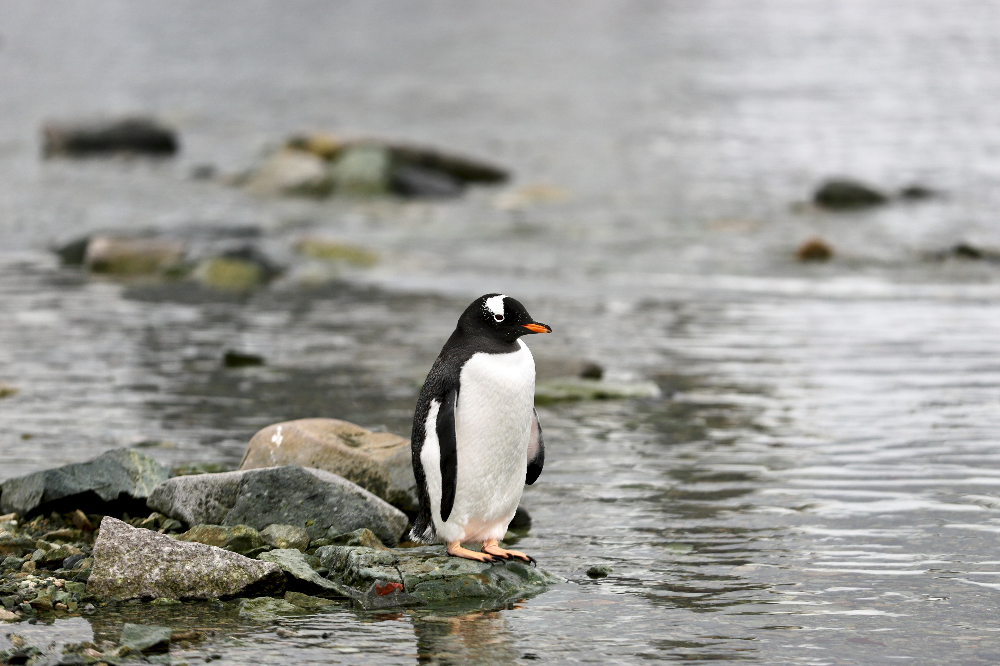

# Cartoon Story Generator

**Cartoon Story Generator** is an intelligent AI-powered pipeline that transforms a single input image into a stylized animated video. By combining image captioning, prompt generation, cartoon-style image synthesis, and AI-based video generation, this system aims to automate visual storytelling from static input.

The core goal of this project is to create a creative tool that enables users to visualize narrative scenes purely from a photo — with no manual editing — powered by state-of-the-art models.

---

## Overview

Given a photo, the pipeline performs:

1. **Image understanding** using the BLIP model to generate a natural language caption.
2. **Cartoon prompt generation** via GPT (OpenAI).
3. **Cartoon-style image creation** using ControlNet with DreamShaper.
4. **Three-part animated story prompt generation** using GPT.
5. **Scene-by-scene animation generation** using RunwayML.
6. **Final output** is a complete animated video representing the story.

---

## Project Structure

```plaintext
cartoon_story_generator/
├── animator.py
├── caption_generator.py
├── cartoonizer.py
├── const.py
├── main.py
├── README.md
├── requirements.txt
├── utils.py
├── data/
│   ├── cartoonized_images/
│   ├── photos/
│   ├── prompts/
│   ├── stories/
│   │   ├── frames/
│   │   └── videos/
│   └── story_prompts/
```

---

## Setup Instructions

### 1. Clone the repository

```bash
git clone https://github.com/meriasatryan/cartoon_story_generator.git
cd cartoon_story_generator
```

### 2. Create and activate virtual environment (Python 3.10 rcommended)

```bash
python3.10 -m venv .venv
source .venv/bin/activate
```

### 3. Install dependencies

```bash
pip install -r requirements.txt
```

### 4. Set up API keys

Export your API keys in the terminal before running the project:

```bash
export OPENAI_API_KEY="your_openai_api_key"
export RUNWAYML_API_SECRET="your_runway_api_key"
```

> Replace the placeholder values with your actual API keys.
> These are required for GPT-based prompt generation and RunwayML animation.

---

## How to Use

1. Place your input images in the `data/photos/` directory.
2. Run the pipeline:

```bash
python main.py --cartoonize
```

To skip cartoonization and animate existing cartoonized images, run:

```bash
python main.py
```

---

## Key Dependencies

- `transformers` (BLIP for image captioning)
- `diffusers` (Stable Diffusion + ControlNet)
- `openai` (GPT for prompt generation)
- `imageio-ffmpeg` (video joining)
- `mediapipe` (optional support in controlnet-aux)
- `runwayml` SDK (image-to-video)
- `Pillow`, `OpenCV`, `torch`, `dotenv`

All dependencies are listed in `requirements.txt`.

---

## Acknowledgements

- **Hugging Face** – for BLIP, DreamShaper, ControlNet
- **OpenAI** – for GPT model that generates prompts and storylines
- **RunwayML** – for high-quality video generation from prompts

---

---

## Example Output

### Input Image:
Here is an example of the input image that starts the process:




### Cartoonized Image:
This is the cartoonized version of the input image, generated by the **Cartoonizer** model:


### Final Animated GIF:
Below is the final animation of the story, created by the **Cartoon Story Generator** pipeline:


